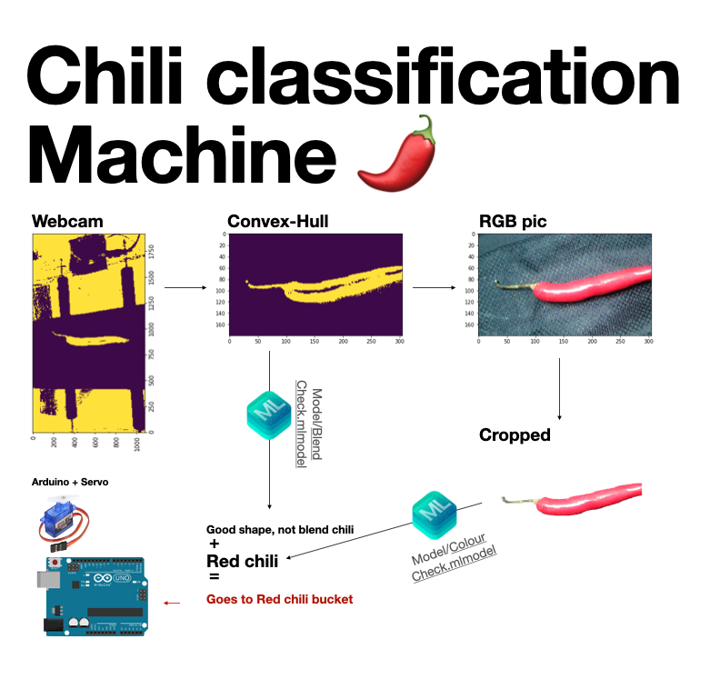

# Chilli_element
Chilli separator machine 

# Arduino Code
https://github.com/H11Maitree/Chilli_element/blob/master/Arduino/sketonmyown/sketonmyown.ino
# Python image processing from Webcam
https://github.com/H11Maitree/Chilli_element/blob/master/real.ipynb
# Overview
1.When the chilli drop into the lazer sensor which attrach to the auduino, the auduino will sent the serial signal though USB to Python Script.

2.Python Script recives the serial, then take a photo of chilli from Webcam.

3.Python Script make a decision to keep or not then store it into a queue.

4.When the queue comes, Python script send the signal by the serial to arduino.

5.Arduino move the servo after getting the signal.
